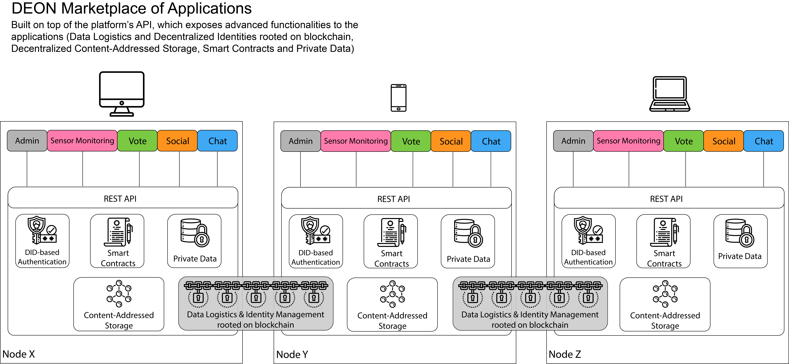
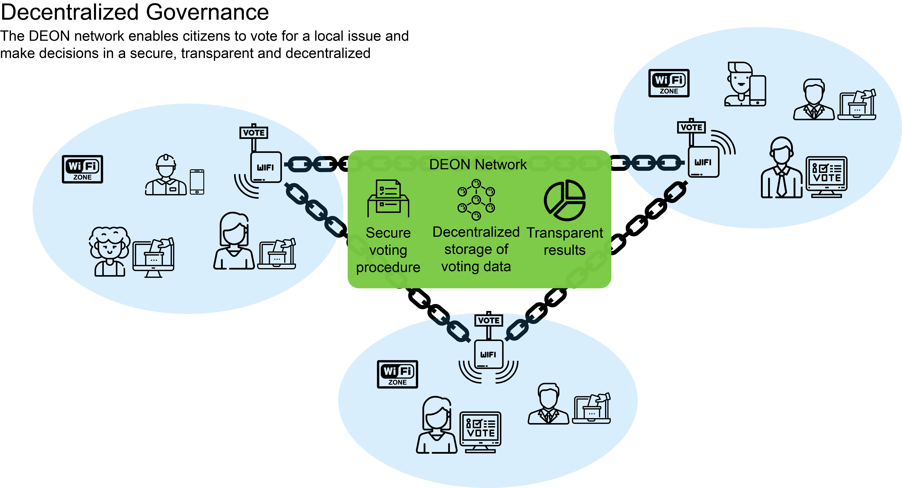

# DEON project

## Overview

DEON is a platform for secure and privacy-respecting decentralized data sharing among untrusted participants in off-grid networks. It enables citizens/communities to deploy their own local networks and either i) access applications and services outside the traditional Internet infrastructure or/and ii) forward Internet connectivity to the local network. DEON nodes are based on low-cost, off-the-shelf equipment (Raspberry Pi boards) and form the DEON off-grid network which offers:
* Decentralized digital identity mechanisms over blockchain, to eliminate Trusted Third Parties and Central Authorities and enable Self-Sovereign Digital Identity.
* Blockchain-enabled distributed file system to eliminate data silos.
* A marketplace of applications that leverage the blockchain layers for authentication/authorization and services based on smart contracts.

## Technical features

The DEON architecture is based on decentralized, open-source technologies:
* Hyperledger Aries/Indy for the Identity management
* Hyperledger Fabric as a general-purpose ledger for data logistics and smart contracts
* IPFS for storing our actual data
* MAZI toolkit for the network infrastructure

**Decentralized Identity Management**
The DEON decentralized identity architecture uses Verifiable Credentials, Zero-Knowledge Proofs and pairwise DIDs, enabling Self-Sovereign Identities in the network. This is accomplished by leveraging the Indy and Aries frameworks and their privacy-by-design tools. This way, all DIDs in DEON are interoperable across local applications, the public Sovrin network [1] and other Decentralized Identity systems as well, following the standards defined in W3C [2] and DIF [3].

**Private data transactions using Hyperledger Fabric**
Only pointers (hashes) of data transactions are stored on chain. They can be used by anyone in the network as evidence that a transaction is made. The actual data are served through IPFS and only authorized nodes have access to them.

**Decentralized file storage using IPFS**
Content-addressable network that combines successful protocols from other peer-to-peer systems. It enables the distribution of high volumes of data with high performance and provides deduplication.

## The Voting Use Case

One of the DEON’s use cases is the Voting application which can be used for decentralized governance at the city neighborhood level or at larger scale. Self-organizing communities need to be sure that those participating in the local voting event will be properly registered, authenticated and authorized to use the platform.

## Acknowledgements

This is a work in progress and 

## References

1. Sovrin Foundation, https://sovrin.org/
2. Decentralized identifiers (DIDs) v1.0, core data model and syntaxes, https://www.w3.org/TR/did-core/
3. DIF decentralized   identity   foundation, https://identity.foundation/
